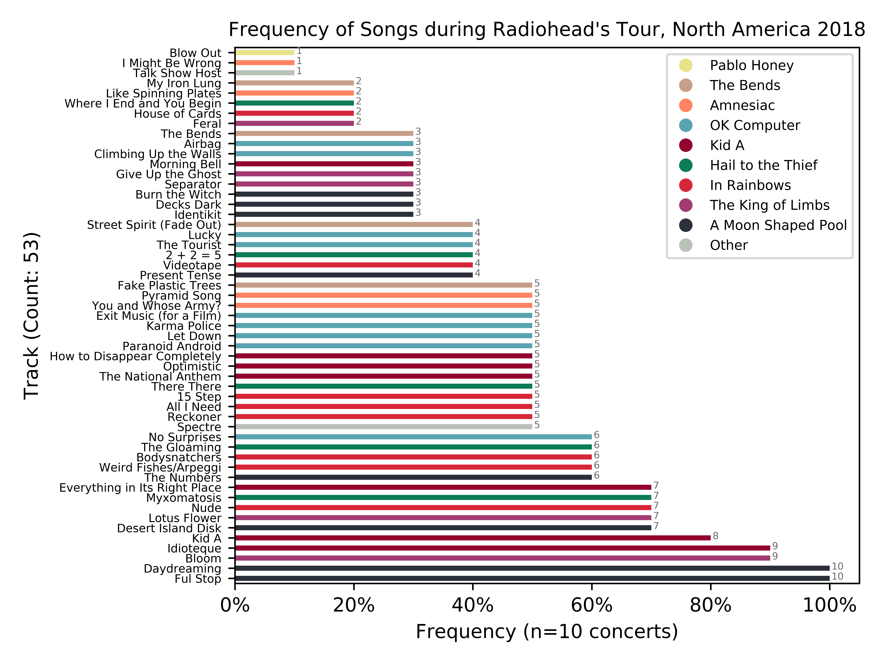

# Hack A Thing - Setlist Visualizer

## Alexander Danilowicz, Weiling Huang



*Dynamically created over the Internet thanks to  Django...*

## What we attempted to build

We both had zero experience with Python web frameworks. Over the summer, I (Alex) wrote a simple, crummy Python script that creates a graph of the frequency of songs played at concerts. We thought it'd be fun to try and hook that script up to the Internet, so anyone can use it. (Please see citations below for script.)

While working at our respective internships this past summer, we both had heard a lot about Django/Flask and their popularity, and we decided that this would be a great opportunity to try out these web frameworks. Having both taken CS52, we were intrigued to try out a new framework and compare it to what we had learned in that class, especially one that prides itself on being very efficient and lightweight while still maintaining a lot of powerful features.

Furthermore, we wanted to see how to integrate some sort of dynamic image generation into a web site - most of our previous projects used static image resources which were always available, but we wanted to see how dynamic image creation/display might be implemented and whether it would be a complex or straight forward process.

Again, we knew nothing about Django/Flask. In fact, we knew so little about Django we thought it was a front-end only framework at first and Flask was back-end only...


## Who did what

1. Alex - completed the initial Django tutorial and set up all of the basic frameworks/boiler plate, created initial landing page, hosted website on pythonanywhere.com, prepared initial script for web, wrote README

1. Weiling - added a form for Django and handled passing user input to script, discovered how to integrate and execute script, created/routed output page, cleaned up general code, contributed to README

1. We both (paired-programming) worked on getting everything working and fully integrating the script into our django framework and producing the output graph. We had no idea if you could even run pandas/matplotlib on a web framework. So, that was cool to figure out.

## What we  learned

Django is really powerful and makes it very easy to create web pages. Flask can be thought of as "mini" Django, but the two are different and are not used together (our initial understanding was that they each handled front vs backend frameworks respectively). You can either have Flask or Django, not both.

We also learned a lot about Django and how to set up the basic framework - how model/views/templates/urls/etc fit together and worked together to display and control a web page. Furthermore, we learned how to pass information between pages and into scripts through requests, particularly how to integrate forms to allow for user inputs to be used. Finally, we learned a little bit about how to control page-flow and logic in an efficient manner, and how to leverage logic regarding different request-types to dictate what our view rendered. Dynamic images were not as difficult as we thought to include, although our current implementation may not be the most efficient or scalable, and definitely could be improved upon with greater knowledge of the web framework.

We also made a number of basic mistakes that we learned from. For example, not making dynamic changes to templates, and not putting dynamic images in the `static` folder. Furthermore, importing the python script and calling it within our framework was much easier/cleaner than rewriting it within the script.

## What didn’t work

Hosting our web page online (instead of locally running it) on pythonanywhere didn't really work. First, I had to pay $5 in order for it to scrape setlistfm. Second, we realized with a lot of users these graphs need to stored somewhere. If we continued working on it, we'd add a chron job or dynamically render the graphs and not actually save them as images.

Furthermore, although the script runs successfully, it also takes a long time to scrape the page/render the image, particularly if there is a large setlist or wide range of dates being examined. Making improvements to our scraping algorithm or the graph creator could help decrease the wait time (we did not prioritize this because the algorithm was not the focus of this Hack-a-Thing, as this was focused on learning Django). Alternatively, some sort of dynamic loading screen while waiting for the script to execute could help display progress.

# Other:

## Issues/Problems:

There are many. But we learned a lot about Django and Python web frameworks.

- We don't have complete error handling because we maxed out on our 10+ hours, and we could not figure out a good way to detect and display errors. So, if you choose your own artist and you get an error, try a different artist or ensure that the fields are correct.

- As noted above, the script takes quite a while to run (30 sec +), so please be patient while waiting for it to run!

## Running it locally

```python3 manage.py runserver```

Then go to: `http://127.0.0.1:8000/`

## Deployed:

Note: The deployed version doesn't work because pythonanywhere 

[setlistvisualizer.pythonanywhere.com](http://setlistvisualizer.pythonanywhere.com)

## Example:

### Example Data Fields:

Arist Unique:

`radiohead-bd6bd12.html`

Start URL:

`wells-fargo-center-philadelphia-pa-13eb054d.html`

End URL:

`td-garden-boston-ma-73eb2ad9.html`


## How do I choose my own concert?

### Arist Unique

This is the unique URL that setlist.fm uses for that artist. For example, if you were to Google search: "Travis Scott setlist fm", you'd probably land here.

```
https://www.setlist.fm/setlists/travis-scott-6bdeaa7e.html
```
**This is what you want:**

```
travis-scott-6bdeaa7e.html
```

That's your Artist Unique.

### Start URL:

What setlist do you want to start at? Say I have a particular timeframe in mind. Then, I would go to the first setlistfm URL I want. Let's start with Dave Matthew's concert at the Gorge:

```
oakland-coliseum-oakland-ca-5be9efa0.html
```

Just take the last half of it. Exclude https.

### Stop URL:

What setlist do you want to end at? If you don't care, then just type:

```
''''
```

Or provide a URL where the tour ended, or any concert you want to stop at.

For example:

```
parque-das-nacoes-lisbon-portugal-3bebec6c.html
```

### Citiations

- Django tutorial 1: [https://docs.djangoproject.com/en/2.1/intro/tutorial01/](https://docs.djangoproject.com/en/2.1/intro/tutorial01/)

- Django tutorial 2: [https://developer.mozilla.org/en-US/docs/Learn/Server-side/Django/skeleton_website)] (https://developer.mozilla.org/en-US/docs/Learn/Server-side/Django/skeleton_website)

- Python Anywhere Blog Post: [https://help.pythonanywhere.com/pages/DeployExistingDjangoProject/
](https://help.pythonanywhere.com/pages/DeployExistingDjangoProject/
)

- Script originally written by Alex Danilowicz as a personal project. Script ran locally. This version is heavily modified and optimized for web from original version.

- Author of original setlistfm scraping (where I got the idea): ryanleewatts.

- Github: https://github.com/ryanleewatts.

- Original script: https://github.com/ryanleewatts/coding-project/blob/master/scraper/SetlistScript.py

- Danilowicz original author of all pandas/matplotlib code, as well as modification of original BeautifulSoup code
